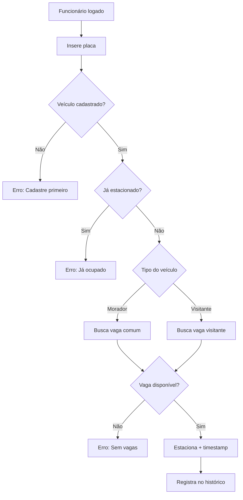
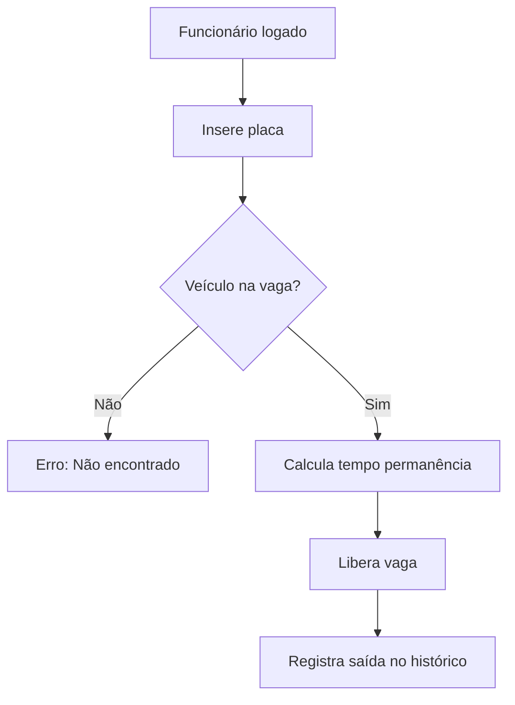
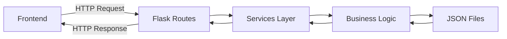

# 🅿️ Sistema de Estacionamento Rotativo - Recantos das Flores I

## 📋 Visão Geral

Sistema completo e profissional para gestão de estacionamento rotativo em condomínios, desenvolvido com Python (Flask), HTML5, CSS3 e JavaScript moderno. O sistema possui layout institucional, responsivo, seguro e modularizado.

---

## 🏗️ Arquitetura do Sistema

### Estrutura Organizacional

```
📁 estacionamento_rotativo1/
├── 🔧 config.py                    # Configurações centralizadas
├── 🚀 app.py                       # Aplicação Flask principal
├── 🧠 estacionamento.py            # Lógica de negócio principal
├── 👨‍💼 supervisor.py                 # Interface do supervisor (terminal)
├── 📦 requirements.txt             # Dependências Python
├── 📚 DOCUMENTACAO_SISTEMA.md      # Esta documentação
├── 📄 README.md                    # Guia de instalação e uso
│
├── 🛠️ services/                    # Camada de serviços
│   ├── veiculo_service.py          # Lógica de veículos
│   ├── funcionario_service.py      # Lógica de funcionários
│   ├── vaga_service.py             # Lógica de vagas
│   └── historico_service.py        # Lógica de histórico
│
├── 🌐 routes/                      # Rotas da API REST
│   ├── veiculos_routes.py          # Endpoints de veículos
│   ├── funcionarios_routes.py      # Endpoints de funcionários
│   └── supervisor_routes.py        # Endpoints do supervisor
│
├── 🎨 templates/                   # Interface HTML
│   ├── index.html                  # Página inicial institucional
│   ├── sistema.html                # Sistema de funcionários
│   ├── supervisor.html             # Login do supervisor
│   └── supervisor_sistema.html     # Sistema do supervisor
│
├── 💾 dados/                       # Persistência JSON
│   ├── veiculos.json              # Dados dos veículos
│   ├── vagas.json                 # Estado das vagas
│   ├── funcionarios.json          # Dados dos funcionários
│   └── historico.json             # Log de todas as operações
│
└── 🎯 static/                      # Assets front-end
    ├── style.css                   # Estilos responsivos
    ├── script.js                   # JavaScript principal
    ├── timer-config.js             # Configurações do timer
    └── imagens/                    # Recursos visuais
```

---

## ⚙️ Lógica Central do Sistema

### 1. **Gestão de Veículos**

#### Tipos de Veículos
- **Moradores**: Têm direito a vagas comuns (1-20)
- **Visitantes**: Podem usar apenas vagas de visitantes (21-30)

#### Processo de Cadastro
```python
# Validações obrigatórias:
- Placa: Formato ABC1234 (antigo) ou ABC1D23 (Mercosul)
- CPF: Validação completa com dígitos verificadores
- Nome: Campo obrigatório
- Modelo: Define automaticamente se é morador/visitante
```

#### Regras de Negócio
- **Uma placa por cadastro**: Não permite duplicatas
- **Normalização automática**: Placas em maiúscula, CPFs apenas números
- **Histórico completo**: Todas as operações são registradas

### 2. **Sistema de Vagas**

#### Configuração Padrão
- **20 vagas comuns** (números 1-20): Exclusivas para moradores
- **10 vagas visitantes** (números 21-30): Para visitantes

#### Estados das Vagas
- **Livre**: `ocupada: false`, sem veículo
- **Ocupada**: `ocupada: true`, com placa e timestamp de entrada

#### Limite de Tempo
- **72 horas (3 dias)**: Tempo máximo permitido
- **Timer regressivo**: Contagem em tempo real no frontend
- **Sistema de alertas**: Visual por cores (verde/amarelo/vermelho)

### 3. **Controle de Acesso**

#### Funcionários
- **Matrícula**: 4 dígitos únicos
- **Login/Logout**: Controle de sessão ativa
- **Permissões**: Cadastrar veículos, estacionar, liberar vagas

#### Supervisor
- **Senha**: Configurável via `SENHA_SUPERVISOR` (padrão: 290479)
- **Permissões especiais**: Cadastrar funcionários, relatórios, remoções

### 4. **Fluxo de Operações**

#### Estacionamento


#### Liberação de Vaga


---

## 🕒 Sistema de Timer Regressivo

### Funcionalidades
- **Contagem em tempo real**: Atualização a cada segundo
- **Formato legível**: `2d 15h 30m 45s`
- **Alertas visuais progressivos**:
  - 🟢 **Verde**: > 25% do tempo restante (normal)
  - 🟡 **Amarelo**: 10-25% do tempo restante (atenção)
  - 🔴 **Vermelho**: < 10% do tempo restante (crítico)
  - 💥 **Flash**: Tempo esgotado

### Implementação Técnica
- **Frontend**: JavaScript puro com `setInterval()`
- **Backend**: Timestamp ISO 8601 com timezone de São Paulo
- **Sincronização**: Auto-refresh a cada 30 segundos
- **Performance**: Cleanup automático previne vazamentos de memória

---

## 🔒 Segurança

### Autenticação
- **Sessão de funcionários**: Controle via `set()` em memória
- **Validação de rotas**: Middleware verifica login antes das operações
- **Senha do supervisor**: Variável de ambiente ou padrão

### Validações
- **CPF**: Algoritmo completo de validação dos dígitos verificadores
- **Placa**: Regex para formatos antigo e Mercosul
- **Sanitização**: Normalização automática de dados de entrada

### Auditoria
- **Histórico completo**: Todas as operações são logadas
- **Timestamps**: Data/hora de cada ação
- **Responsabilidade**: Registra qual funcionário executou cada operação

---

## 🎨 Interface do Usuário

### Design Responsivo
- **Mobile-first**: Layout otimizado para dispositivos móveis
- **CSS Grid/Flexbox**: Layout moderno e flexível
- **Acessibilidade**: Contrastes adequados e navegação por teclado

### Experiência do Usuário
- **Feedback imediato**: Mensagens claras de sucesso/erro
- **Loading states**: Indicadores visuais durante operações
- **Navegação intuitiva**: Botões "Voltar" e breadcrumbs

### Componentes Principais
- **Página inicial**: Layout institucional com informações do condomínio
- **Sistema de funcionários**: Interface operacional completa
- **Painel do supervisor**: Acesso a funções administrativas
- **Status das vagas**: Visualização em tempo real com timer

---

## 🔄 Fluxo de Dados

### Persistência


### Estrutura JSON
```json
{
  "veiculos": [
    {
      "placa": "ABC1234",
      "cpf": "12345678901",
      "nome": "João Silva",
      "modelo": "Honda Civic",
      "tipo": "morador",
      "bloco": "A",
      "apartamento": "101"
    }
  ],
  "vagas": [
    {
      "numero": 1,
      "tipo": "comum",
      "ocupada": true,
      "veiculo": "ABC1234",
      "entrada": "2025-01-29T10:30:00-03:00"
    }
  ]
}
```

---

## 🚀 Tecnologias Utilizadas

### Backend
- **Python 3.10+**: Linguagem principal
- **Flask 2.3.3**: Framework web minimalista
- **Flask-CORS**: Suporte a CORS para APIs
- **pytz**: Manipulação de fusos horários

### Frontend
- **HTML5**: Estrutura semântica
- **CSS3**: Estilos modernos com Grid/Flexbox
- **JavaScript ES6+**: Lógica do cliente sem frameworks

### Dados
- **JSON**: Persistência simples e legível
- **UTF-8**: Codificação para caracteres especiais

---

## ⚡ Performance

### Otimizações
- **Lazy loading**: Carregamento sob demanda de seções
- **Cache de dados**: Minimiza requisições desnecessárias
- **Cleanup de timers**: Previne vazamentos de memória
- **Compressão de assets**: CSS/JS otimizados

### Escalabilidade
- **Arquitetura modular**: Fácil manutenção e extensão
- **Separação de responsabilidades**: Camadas bem definidas
- **Configuração centralizada**: Mudanças simples via `config.py`

---

## 🧪 Testes e Qualidade

### Validações Implementadas
- **Entrada de dados**: Sanitização automática
- **Regras de negócio**: Validações em múltiplas camadas
- **Estados consistentes**: Verificações de integridade

### Logging
- **Níveis configuráveis**: Debug, Info, Warning, Error
- **Formato estruturado**: Timestamp, módulo, nível, mensagem
- **Rastreabilidade**: Logs de todas as operações críticas

---

## 🔧 Configuração e Personalização

### Variáveis de Ambiente
```bash
# Senha do supervisor
export SENHA_SUPERVISOR="suasenhaaqui"

# Ambiente de execução
export FLASK_ENV="production"  # ou "development"
```

### Constantes Configuráveis (config.py)
- `LIMITE_HORAS_ESTACIONAMENTO`: Tempo máximo permitido
- `VAGAS_COMUNS` / `VAGAS_VISITANTES`: Quantidade de vagas
- `PORCENTAGEM_WARNING` / `PORCENTAGEM_CRITICAL`: Alertas visuais

### Mensagens Personalizáveis
Todas as mensagens do sistema estão centralizadas na classe `Config.Mensagens`, permitindo fácil personalização e internacionalização.

---

## 📈 Roadmap de Melhorias

### Próximas Versões
- **Banco de dados**: Migração para PostgreSQL/MySQL
- **Autenticação JWT**: Sistema de tokens mais robusto
- **Relatórios avançados**: Dashboard com métricas
- **Notificações**: Email/SMS para tempo excedido
- **API REST completa**: Documentação OpenAPI
- **Testes automatizados**: Cobertura completa

### Integrações Futuras
- **Sistema de pagamento**: Cobrança automática por tempo
- **Controle de portão**: Integração com hardware
- **App mobile**: React Native ou Flutter
- **BI Dashboard**: Analytics de uso das vagas

---

**Desenvolvido por**: Anderson Jacinto da Silveira  
**Projeto**: Sistema de Estacionamento Rotativo - Recantos das Flores I  
**Versão**: 2.1.0 - Refatoração e Boas Práticas  
**Data**: Janeiro 2025 